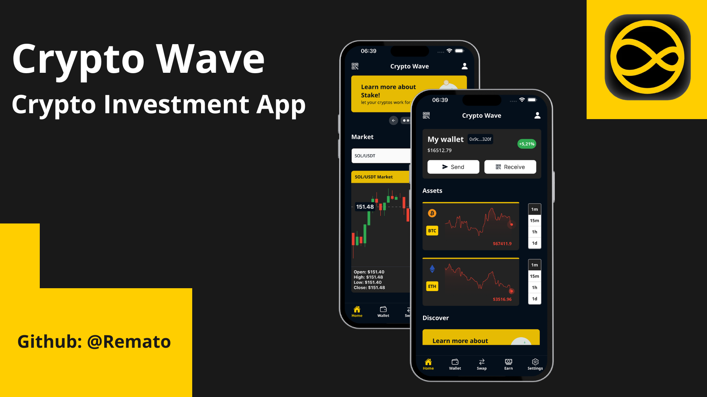

# Crypto Wave — Live Crypto Market Dashboard

Crypto Wave is a React Native market dashboard that combines historical Binance candlestick data with real-time WebSocket updates. The project includes an Expo mobile frontend and a lightweight Express API proxy.

> This project is a market-data interface and UI prototype. It does not connect to a real wallet or execute cryptocurrency trades.

<p align="center">
  
</p>

## Features

- Live BTC and ETH price charts powered by Binance WebSocket streams
- Selectable `1m`, `15m`, `1h`, and `1d` chart intervals
- Candlestick charts with open, high, low, and close values
- Eight configured USDT markets with searchable selection
- Interactive chart cursors with haptic feedback
- Animated splash screen and promotional cards
- Responsive five-tab Expo Router navigation
- Dark reusable design system

## Current scope

The Home tab contains the working market dashboard. Wallet, Swap, Earn, and Settings currently demonstrate the navigation and animation patterns but remain placeholder screens. The displayed wallet address and balance are sample data, and the Send and Receive buttons are not connected to wallet operations.

## Architecture

```text
Expo application ──HTTP──> Express API ──HTTP──> Binance REST API
       │
       └──────────── WebSocket ──────────> Binance market streams
```

- The backend proxies public Binance REST endpoints on port `3001`.
- The frontend loads initial chart data through the backend.
- Binance WebSocket streams update the active charts in real time.

## Tech stack

### Frontend

- Expo SDK 51
- React Native 0.74
- TypeScript
- Expo Router
- Tamagui
- Zustand
- React Native Reanimated
- React Native Wagmi Charts
- React Use WebSocket
- Lottie animations

### Backend

- Node.js
- Express
- Axios
- CORS
- dotenv

## Project structure

```text
.
├── .github/                    # Repository preview images
├── backend/
│   ├── src/api/binance.js      # Binance REST requests
│   ├── src/server.js           # Express routes and server startup
│   └── package.json
├── frontend/
│   ├── @types/                 # Shared TypeScript declarations
│   ├── api/                    # Backend API client
│   ├── app/                    # Expo Router routes
│   ├── assets/                 # Icons, images, and Lottie animations
│   ├── components/             # Charts and reusable UI components
│   ├── mock/                   # Supported market options
│   ├── services/               # Data-fetching and parsing layer
│   ├── stores/                 # Zustand exchange state
│   ├── styles/                 # Colors, spacing, and typography
│   └── utils/                  # Parsers and enums
└── README.md
```

## Getting started

### Prerequisites

- A current Node.js LTS release
- Yarn
- Expo Go, Android Studio, or Xcode

### 1. Clone the repository

```bash
git clone https://github.com/AdityaBansal0123/Trading_App.git
cd Trading_App
```

### 2. Configure and run the backend

The backend expects this environment variable in `backend/.env`:

```env
BINANCE_BASE_URL=https://api.binance.com/api/v3
```

Install dependencies and start the server:

```bash
cd backend
yarn install
node src/server.js
```

The API will listen on `http://localhost:3001`.

### 3. Run the frontend

Open a second terminal:

```bash
cd frontend
yarn install
yarn start
```

Use the Expo terminal to open Android, iOS, or the web version.

### Running on a physical device

The frontend currently uses `http://localhost:3001` in `frontend/api/binance.tsx`. On a physical phone, `localhost` refers to the phone itself. Replace it with the development computer's LAN address, such as `http://192.168.1.10:3001`, and ensure both devices are on the same network.

For an Android emulator, use `http://10.0.2.2:3001`. The iOS simulator can normally access the computer through `http://localhost:3001`.

## API endpoints

| Endpoint | Purpose |
| --- | --- |
| `GET /tickers` | Fetch Binance exchange information |
| `GET /klines?symbol=BTCUSDT&interval=1m` | Fetch 60 closing-price points |
| `GET /uiKlines?symbol=BTCUSDT&interval=1m` | Fetch 30 candlestick entries |

## Supported markets

- BNB/USDT
- BTC/USDT
- ETH/USDT
- MATIC/USDT
- NEAR/USDT
- PENDLE/USDT
- RNDR/USDT
- SOL/USDT

## Available frontend scripts

| Command | Description |
| --- | --- |
| `yarn start` | Start the Expo development server |
| `yarn android` | Open the Android target |
| `yarn ios` | Open the iOS target |
| `yarn web` | Open the web target |
| `yarn lint` | Run Expo linting |
| `yarn test` | Run Jest in watch mode |

## Data and risk notice

Market information is provided by Binance and may be delayed, interrupted, or unavailable in some regions. This application is a demonstration project and does not provide financial advice.

## Repository

https://github.com/AdityaBansal0123/Trading_App
